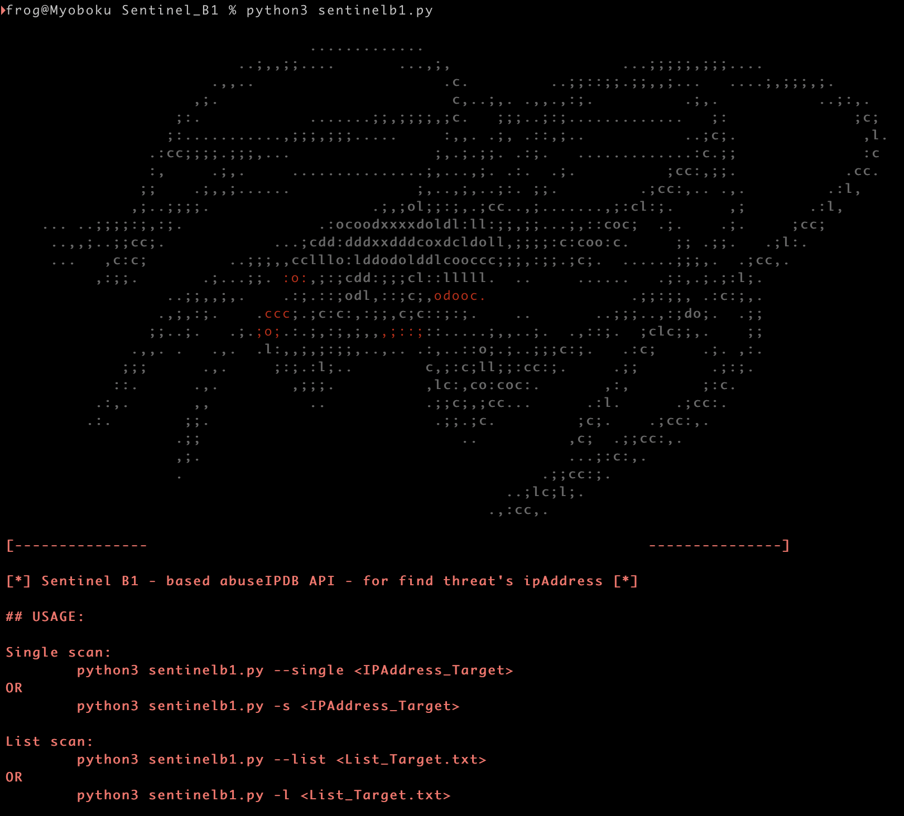
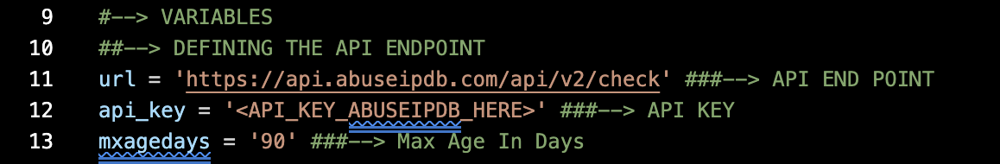
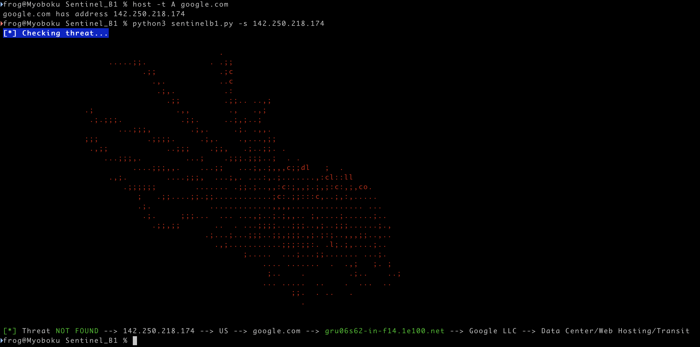
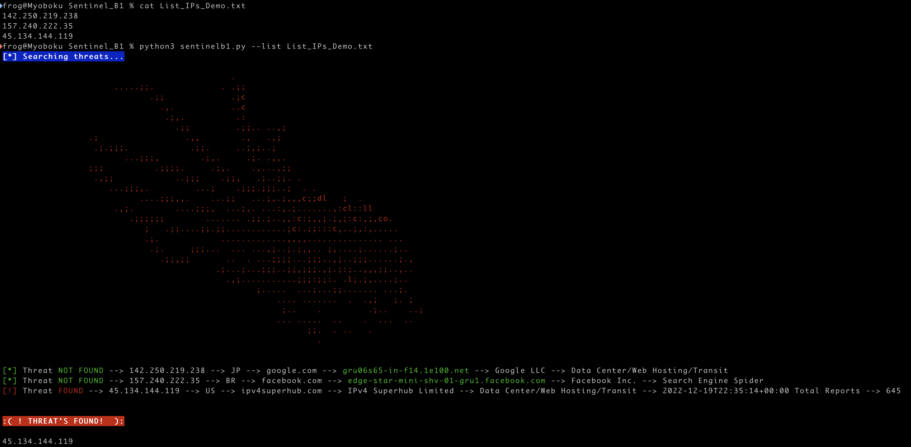

# Sentinel B1  
> For find threat IPs with AbuseipDB API.   
#  
[](https://matrix.fandom.com/wiki/Sentinel)  
#   
## Dependencies   
Most of the libraries used are already native to ```Python3```, but make sure you have adequate support for each of them.  
### **requests:**   
```python3
agentsmith@matrix:~$ python3 -m pip install requests
```
### **json:**   
```python3
agentsmith@matrix:~$ python3 -m pip install json
```
### **sys:**   
```python3
agentsmith@matrix:~$ python3 -m pip install sys
```   
## Variables   
There are only 3 variables that need attention before the script is executed.  
#   
[](https://www.abuseipdb.com/check/142.250.218.74)  
#   
1. * **URL:**  
     - This variable is found in ```line 11``` of the script and it sets the API endpoint of abuseIPDB.   
2. * **API_KEY:**  
     - This variable is in ```line 12``` of the script and it should contain the API key for your account at https://www.abuseipdb.com/ (registration is free.)   
3. * **MXAGEDAYS:**
     - This variable is on ```line 13``` of the script and it sets the search time on the abuseipdb base in days.  

* More information:  
  - [Documentation API abuseIPDB](https://docs.abuseipdb.com/?python#introduction "Click here")  
## Single Scan  
For single scan execute the fallow command:  
```python3
agentsmith@matrix:~$ python3 sentinelb1.py --single <TARGET_IP>
``` 
#   
[](https://www.abuseipdb.com/check/142.250.218.74)   
#  
## Multiple Scan  
For scan with list IP's execute the fallow command:  
```python3
agentsmith@matrix:~$ python3 sentinelb1.py -l <LIST_IPs.txt>
``` 
#   
[](https://www.abuseipdb.com/)   
#  
## Hashes
### Sha512     
```
82dac120794f31dd698835c31378415eb90525572f6ccec7c3fdb3214d04a7f519d693694d01244e1051bdc74601f98a79ad23eea817140e12bcc37030183fd5  sentinelb1.py
````
### Sha256     
```
383c8f1f3013abbab246ca652f11761f81c073df566fe593705131add712694a  sentinelb1.py
```
### MD5     
```
c7514dbbd76ce8c32cd641aee41120c5  sentinelb1.py
```
:frog: